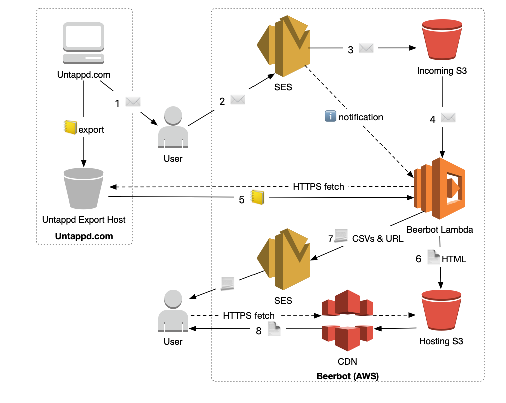

## Lambda Operations

1) User requests export on Untappd.com, which produces the export, storing it online, and sends an email to the user containing a link to it.
1) The user forwards this export email to beerbot, which receives it via SES
1) SES stores that email to a bucket and triggers the lambda with details of the message.
1) The lambda fetches the email and parses it to find the download link.
1) The lambda fetches the export from the URL given in the email
1) The lambda processes the export and produces CSV and HTML reports. The HTML report is stored to a bucket linked to a CDN.
1) The lambda packs the URL of the HTML report, together with the CSV files, into an email and sends this through SES to the user.
1) The user can now download the HTML on demand via the CDN.