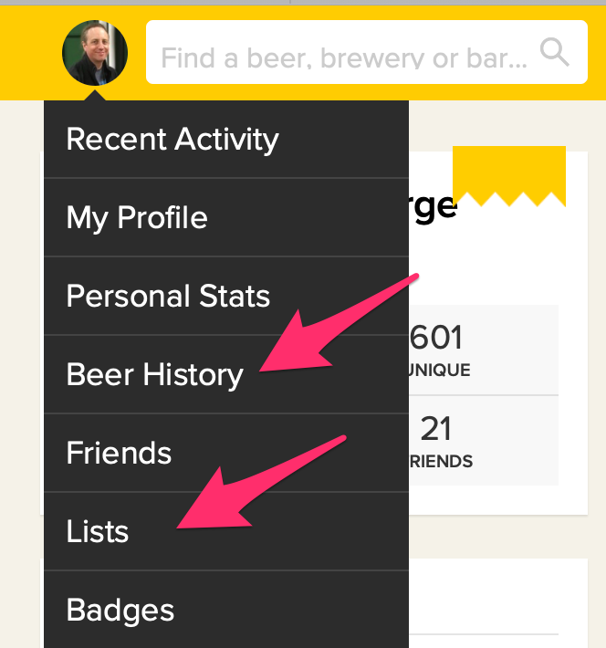
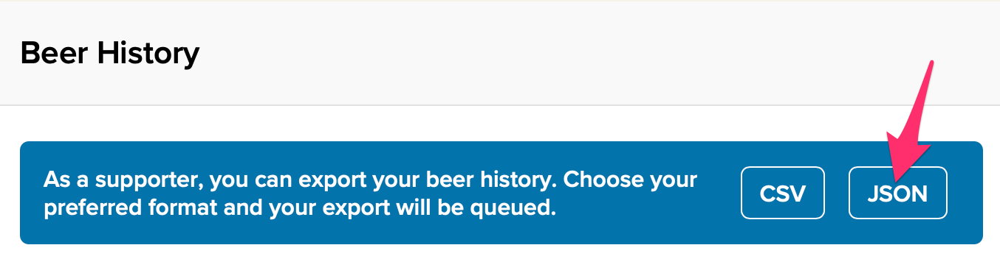
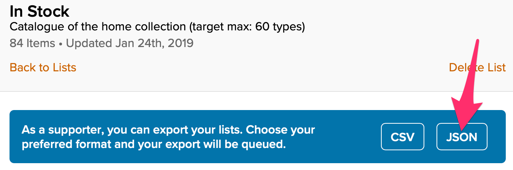

---
---

## Exporting your data from Untappd

**Reminder: You have to be an Untappd Supporter to use this feature.**

You can export two kinds of data from Untappd - Checkins (aka Beer History) and Lists. 

⚠️ For some reason, the export buttons are not shown when you view Untappd on a small mobile device - you'll have to do 
this on a tablet, laptop or desktop.

### Exporting checkins

Your "Beer History" page gives you the following options:

Beerbot works with JSON data, but you can also request a CSV export for your own use.

To export your checkin history, click the JSON button, wait a couple of minutes (usually), then check your email 
for a message entitled "Your Export from Untappd".

### Exporting a list

Individual list pages also allow you to export their data. As before, Beerbot expects JSON data.

To export a list, click the JSON button, wait a couple of minutes (usually), then check your email 
for a message entitled "Your Export from Untappd".

### Using the exports

If you're running the code at home, click the link in the export email, download the file that's fetched in your browser, 
and refer to [{{ site.github.project_title }}]({{ site.github.repository_url }}#readme).

If you've [asked for access](INDEX.md#forward-by-email), just forward the whole, unmodified email to the address you've 
been given. Beerbot will reply to the address you send from.  Please use the simpler forwarding option in your mail 
client, don't "forward as attachment".

## Further information

Untappd's documentation on list exports is 
[here](https://help.untappd.com/support/solutions/articles/25000001978-where-can-i-find-the-exportable-data-feature-).

