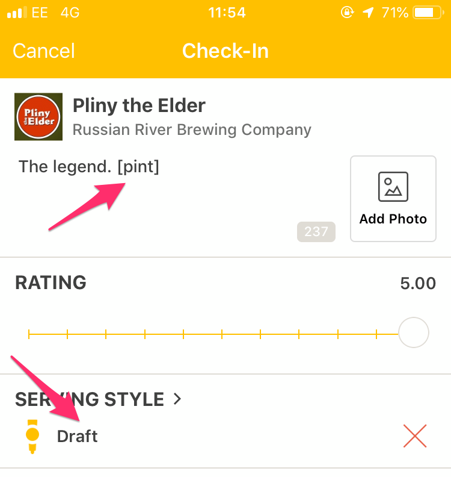
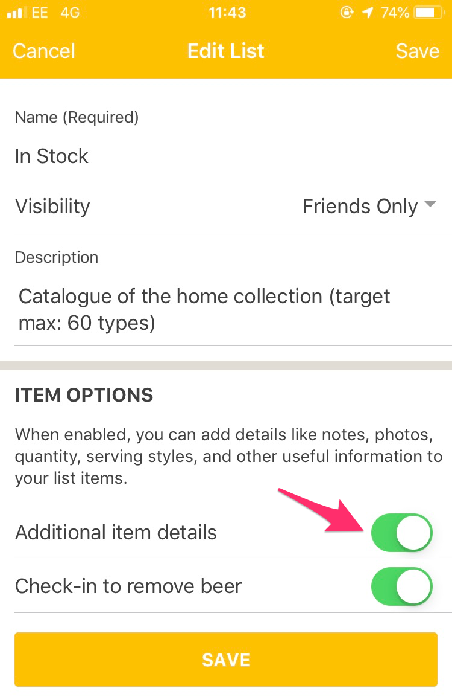

---
---

# Feeding Beerbot

Like any data processing tool, the quality of Beerbot's output depends on the quality of its input. While it will make
a best effort to process any export, it will be more useful and effective if you give it particular information:

## Checkins

As Untappd is primarily geared toward sharing and enjoying beer, it doesn't track the measure of each drink. 
However, one of Beerbot's uses is to help you gauge and manage consumption, so it needs that data.

It can obtain it in one of two ways. If you've saved the "Serving Style" field in your checkin, it'll make a guess from 
that. It assumes that Draft and Bottle are half-pints, Cans and Bottles are 300ml, and Tasters are 150ml. 
It can't guess at anything else so will skip that beer when calculating consumption.
If you download and run the code yourself, you can edit these defaults, but they're fixed for email users.

If these defaults don't work for you, you want to note that you checked in a taste or sip, or you just want to be more 
precise, you can embed the measure in your comment field, in `[square brackets]`. 

Brewbot recognises a number of measures, eg:

    [pint] or [litre]
    [half], [third] or [quarter]
    [2/3], [1/2], [1/3] etc
    [330ml]
    [50cl]
    [2pints]
    [halflitre]

Any fractional units, whether word or numeric, are assumed to be fractions of a pint if litre(s) are not specified.

## Lists

Beerbot works best with lists that have "Additional Item Details", as its list processing functionality is geared
towards managing a home collection. You can manage this in the app when you edit the list:

The more information you add to each item on your list, the more Beerbot can do with it. In particular, adding 
Quantity, Serving Style and Best By Date is recommended.
