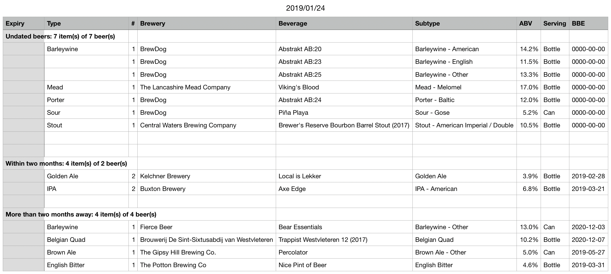
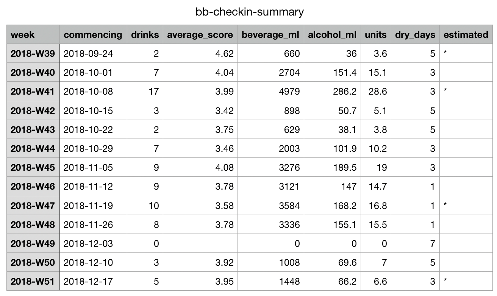
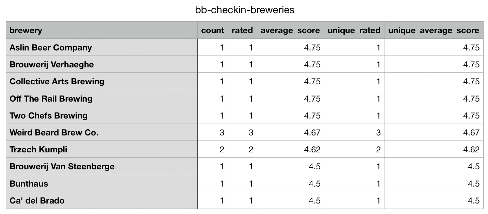
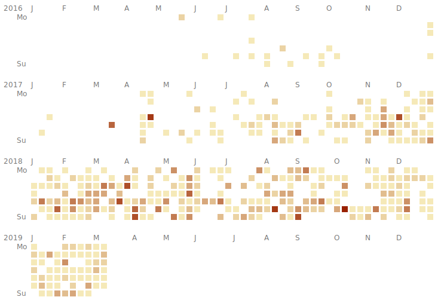

---
---
# Beerbot: doing more with your Untappd data

Beerbot is a tool to make better use of your [Untappd](https://untappd.com/) lists and checkin history. 
It generates convenient stock lists, weekly summaries of the beers you've drunk, and analysis of your favourite styles 
and venues. Outputs are CSVs that you can format, analyse and print in any spreadsheet program.

### Stock list
 [Sample csv](files/stocklist-sample.csv)

### Weekly summary
 [Sample csv](files/checkin-summary-sample.csv)

### Breweries analysis
 [Sample csv](files/checkin-breweries-sample.csv)

### Daily visualisation

## Using Beerbot

To use it, you'll need to be able to use Untappd's export tools, which means you'll need a paid 
[Untappd Supporter Account](https://untappd.com/supporter).

You can use the tools in one of two ways - either download the code and run it yourself, or just forward your 
Untappd export emails to the service.

### Run at home
You'll need a little patience or some experience running Python code to do this. Everything is available and documented
at [{{ site.github.project_title }}]({{ site.github.repository_url }}#readme).

This is the slightly more powerful, but less convenient option.

### Forward by email
Beerbot can also be used entirely from your email client. Simply forward the emails that Untappd sends you when you 
export your data to `beerbot@beerbot.phase.org` and it'll reply with the results. 
Reports will be attached as CSVs, and your latest list export will also be stored privately online.

#### ⚠️ Important

 - Please read the section on "Getting your data" below to make sure you export your data in a way that Beerbot
 understands.   
 - Emails must be forwarded as-is, without modification, for Beerbot to handle them. Use simple forwarding rather than
 any "forward as attachment" option.
 - Your online lists are stored with no identifying data at a non-guessable URL and expire 30 days after you forward the email. 
 Subsequent submissions will be stored at the same location, so just export & forward your data at least once a month 
 to keep the list online permanently.
 - As there is no information about which list you've chosen to export in Untappd's data, only your latest list submission 
 can be stored online.
 - If Beerbot doesn't reply, or it reports an error, please report the issue to [richard@parsingphase.dev](mailto:richard@parsingphase.dev?subject=Beerbot Issue). 
 Note that I may ask you to forward your export email to resolve complex issues, but even if you're not happy sharing 
 that data, all fault reports will be gratefully appreciated.
 - This is a free, non-configurable service. If you're not happy sharing your data or having your list be reachable online
 (albeit anonymously and at a non-indexed, non-guessable URL), please run the code at home rather than using the email forwarder.

### Getting your data

The process for getting your data, whether for personal download or for email forwarding is described in 
"[Exporting your data](exporting.md)". 

### Making the best of Beerbot

Beerbot will make a best effort to process any export it's fed, but you can get a lot more out of it if you
[feed it the best data](feedingBeerbot.md).
